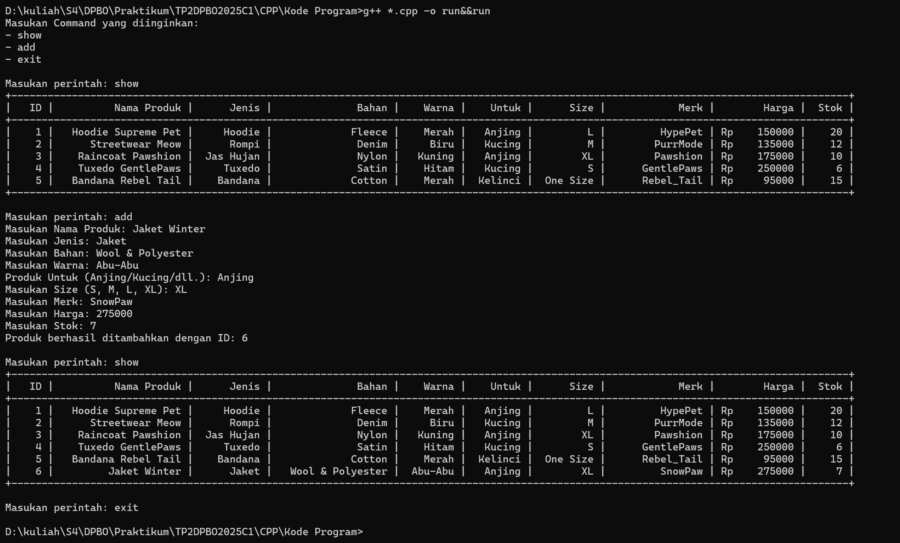

# Tugas Praktikum 2 - DPBO

## Janji
_Saya, **Hafsah Hamidah** dengan NIM **2311474**, mengerjakan **Tugas Praktikum 2** dalam mata kuliah **DPBO** dengan sebaik-baiknya demi keberkahan-Nya.  
Saya berjanji tidak melakukan kecurangan sebagaimana yang telah dispesifikasikan. **Aamiin.**_
## Diagram

## Desain
Program ini terdiri dari tiga kelas utama: **PetShop**, **Aksesoris**, dan **Baju**, yang diimplementasikan menggunakan **Multilevel Inheritance**. Dalam hierarki ini, **PetShop** berperan sebagai kelas induk karena memiliki atribut yang paling umum, diikuti oleh **Aksesoris**, dan **Baju** sebagai kelas paling spesifik.

Berikut adalah struktur pewarisannya:
1. **PetShop** (kelas dasar) menyimpan atribut umum yang mencakup:
   - ID
   - Nama Produk
   - Stok Produk
   - Harga Produk
   - Foto (hanya digunakan dalam PHP)

2. **Aksesoris** (kelas turunan dari PetShop) menambahkan atribut tambahan yang berkaitan dengan karakteristik produk:
   - Jenis
   - Bahan
   - Warna

3. **Baju** (kelas turunan dari Aksesoris) memperluas fungsionalitas dengan atribut yang lebih spesifik untuk pakaian:
   - Target Pengguna (Misalnya: Anjing, Kucing, Kelinci)
   - Ukuran (Size)
   - Merk (Brand)

Dengan struktur ini, **Multilevel Inheritance** memungkinkan program untuk **mengelompokkan atribut secara hierarkis**, menjaga efisiensi, serta mempermudah pengelolaan data produk dalam sistem.

## **Dokumentasi & Penjelasan**  

Dalam implementasi menggunakan **C++**, **Java**, dan **Python**, program akan memberikan tiga opsi perintah utama kepada pengguna setelah dijalankan:  
- `add` → Menambahkan data baru ke dalam sistem.  
- `show` → Menampilkan seluruh data yang telah tersimpan.  
- `exit` → Menghentikan atau keluar dari program.  

### **Catatan:**  
- **ID dalam program ditetapkan secara otomatis (auto-increment)**, sehingga setiap data yang ditambahkan akan memiliki ID yang bertambah secara otomatis.  
- Program akan terus menerima input dari pengguna hingga perintah **`exit`** diberikan.
  
### C++

    

### JAVA

    

### PYTHON

    

### PHP

    

#### **Catatan:**  
- Dalam kode **PHP**, perintah input dijalankan secara **hardcoded**, yaitu dengan menjalankan perintah **show**, kemudian **add**, dan diakhiri dengan **show** kembali.
